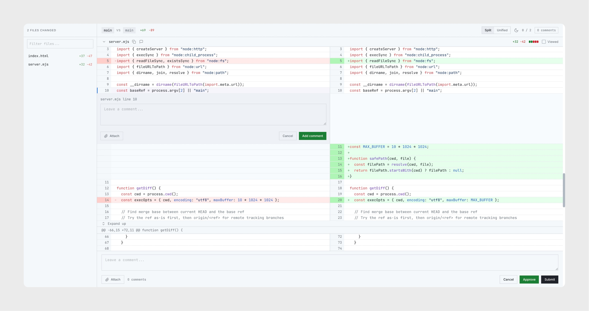

<p align="center">
  
</p>

<h1 align="center">linemark</h1>

<p align="center">Code review for AI agent changes. In the browser. Before they go in.</p>

<p align="center">
  
</p>

## The problem

AI coding agents write code fast. Reviewing it is the bottleneck.

You're staring at a terminal diff, trying to parse what changed across eight files. You spot something wrong on line 47 but there's no way to point at it. So you type "actually, on line 47 of auth.ts, the token expiry should be..." and hope the agent understands which line you mean.

This is a code review problem. We solved it years ago with pull requests. But PR review UIs are designed for commits that have already been pushed. Not for local changes from an agent sitting in your terminal waiting for feedback.

## The insight

The feedback loop between you and an AI agent should feel like a pull request review. You see the diff. You click a line. You leave a comment. The agent reads your comments and addresses each one.

That's what linemark does. Type `/linemark` in [Claude Code](https://docs.anthropic.com/en/docs/claude-code), and it opens a diff review UI in your browser. You annotate. You submit. Structured feedback goes back to the agent.

No copy-pasting line numbers. No "on line 47 of auth.ts." Just click, comment, submit.

<p align="center">
  <video src="https://github.com/user-attachments/assets/d10bbac2-417b-44c2-81f2-f75809ac2514" width="720" autoplay loop muted playsinline></video>
</p>

## Install

```bash
curl -fsSL https://raw.githubusercontent.com/gdaybrice/linemark/main/install.sh | bash
```

This clones linemark to `~/.linemark` and registers `/linemark` as a global Claude Code slash command. Works in any project. Just Node.js 18+, zero other dependencies.

## Usage

1. Make changes (or let Claude make them)
2. Type `/linemark`
3. Review the diff in your browser
4. Comment on anything you want changed
5. **Submit** to send feedback, or **Approve** to accept

Claude reads your comments and addresses each one. You can run `/linemark` again to review the next round. Repeat until you're happy.

## What you get

- Side-by-side and unified diff views
- Inline comments on lines, ranges, or whole files
- Image attachments (paste, drag, or pick)
- File tree with search
- Collapsible files with "Viewed" tracking
- Syntax highlighting

## How it works

`/linemark` starts a local server that diffs your working tree against the base branch. It injects the diff data into a single-page review UI and opens it in your browser. When you submit, your comments come back as structured feedback on stdout. Claude Code reads them and acts on each one.

One file for the server. One file for the UI. No build step. No dependencies beyond Node.